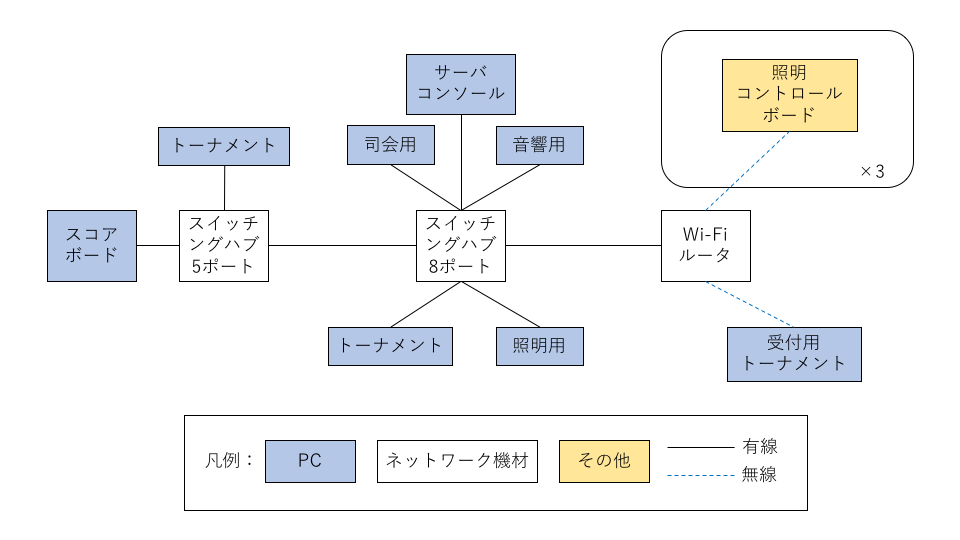

# 0.「ちばロボ」運営用システム
　このシステムは千葉大学ロボットコンテスト（ちばロボ）を運営するためのシステムです。ちばロボ用のシステムではありますが、トーナメント制のロボコンを運営するのに便利なシステムではあると思います。詳しくはこのレポジトリのWiki（更新予定）をご覧ください。
  
↓WikiAddress↓  
https://github.com/UHey-JPN/show_tour-Reference/wiki

keyword: ちばロボ、千葉ロボ、ちばろぼ、トーナメントシステム、

# 1.「千葉ロボ」においての運用について
|用語|説明|
|---|---|
|上手|客席から舞台に向かって右側|
|下手|客席から舞台に向かって左側|

## 1.1 準備する機材
1. システム・通信系
	1. PC(Windowsがおすすめ) ・・・8台
	1. Wi-Fiルータ ・・・1台
	1. スイッチングハブ ・・・5ポート、8ポート1台ずつ
	1. イーサネットケーブル ・・・必要数
1. 照明系
	1. 照明コントロールボード ・・・3台
	1. 照明用電源(12V4A) ・・・2台
	1. 照明用電源(12V2A) ・・・2台
	1. PARライト ・・・6台
	1. フットライト ・・・4台
1. 音響系
	1. 大型スピーカ ・・・1組
	1. 小型スピーカ ・・・1組
	1. アナログミキサー ・・・1台
	1. ダイナミックマイク ・・・2本
	1. ケーブル（マイク⇔ミキサ）（XLR⇔XLR） ・・・2本
	1. ケーブル（PC⇔ミキサ）（ミニフォンオス⇔RCAオス） ・・・1本
	1. ケーブル（ミキサ⇔大スピーカ）（RCAオス⇔RCAオス） ・・・1本
	1. ケーブル（ミキサ⇔小スピーカ）（ミニフォンオス⇔ミニフォンメス） ・・・1本
	1. 変換プラグ（ミキサーのOUT）（フォンオス⇔RCAメス） ・・・2個
	1. 変換プラグ（ミキサーのMonitor）（フォンオス⇔ミニフォン） ・・・1個
1. 画面等
	1. プロジェクタ ・・・2台

## 1.2 機材のセットアップ
### (1) システム・通信系
1. ネットワークを構築  
	次に示す図のようにPC及びネットワーク機材を接続する。  
	
1. 各ソフトをダウンロードして起動  
	起動するソフトは以下の通り。すべてのプログラムは、GitHubにアップロードされています。
	1. スコアボードプログラム  
		ダウンロードするもの：ChibaRobo_SBoard.zip

	1. トーナメントプログラム  
		ダウンロードするもの：TournamentSystem2.zip

	1. サーバとコンソール（2つのプログラムを一つのPCで実行）  
		ダウンロードするもの：ChibaRoboConsole_v2.zipとChibaRoboServer_v2.zip

	1. 照明用プログラム  
		ダウンロードするもの：light_control.zip

	1. 音響用プログラム  
		ダウンロードするもの：SoundManager.zip  
		音楽ファイルは著作権の関係でアップロード出来ないので、上の人から受け継いでください。

	1. 司会用プログラム  
		ダウンロードするもの：ChibaRoboViewer_v2.zip

### (2) 照明系
1. 照明コントロールボードの設定  
	照明コントロールボードには番号が設定されていて、下の段のジャンパーピンで設定できる。それぞれ、以下のように設定する。また、ボードに付いているDCジャックの数により配置する場所が決まっていて、使用するACアダプタの種類も決まっている。

|場所|番号|ボード上のDCジャックの数|使用するACアダプタ|
|---|:-:|:-:|:-:|
|下手側| 0 | 1 | 12V5A (1個) |
|ステージ下| 1 | 2 | 12V4A (2個) |
|上手側| 2 | 1 | 12V5A (1個) |

2. ケーブルの接続

