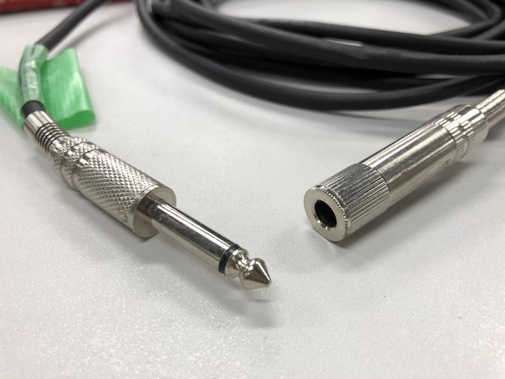

# 0.「ちばロボ」運営用システム
　このシステムは千葉大学ロボットコンテスト(ちばロボ)を運営するためのシステムです。ちばロボ用のシステムではありますが、トーナメント制のロボコンを運営するのに便利なシステムではあると思います。詳しくはこのレポジトリのWiki(更新予定)をご覧ください。
  
↓WikiAddress↓  
https://github.com/UHey-JPN/show_tour-Reference/wiki

keyword: ちばロボ、千葉ロボ、ちばろぼ、トーナメントシステム、

# 1.「千葉ロボ」においての運用について
|用語|説明|
|---|---|
|上手|客席から舞台に向かって右側|
|下手|客席から舞台に向かって左側|

コネクタの種類  

- XLR  

- フォン  

- RCA  

- ミニフォン  

## 1.1 準備する機材
1. システム・通信系
	1. PC(Windowsがおすすめ) ・・・8台
	1. Wi-Fiルータ ・・・1台
	1. スイッチングハブ ・・・5ポート、8ポート1台ずつ
	1. イーサネットケーブル ・・・必要数
1. 照明系
	1. 照明コントロールボード ・・・3台
	1. 照明用電源(12V4A) ・・・2台
	1. 照明用電源(12V2A) ・・・2台
	1. PARライト ・・・6台
	1. フットライト ・・・4台
1. 音響系
	1. 大型スピーカ ・・・1組
	1. 小型スピーカ ・・・1組
	1. アナログミキサ ・・・1台
	1. ダイナミックマイク ・・・2本
	1. ケーブル(マイク⇔ミキサ)(XLR⇔XLR) ・・・2本
	1. ケーブル(PC⇔ミキサ)(ミニフォンオス⇔RCAオス) ・・・1本
	1. ケーブル(ミキサ⇔大スピーカ)(RCAオス⇔フォンオス) ・・・1本
	1. ケーブル(ミキサ⇔大スピーカ)(フォンオス⇔フォンメス) ・・・2本
	1. ケーブル(下手スピーカ⇔上手スピーカ)(RCA⇔RCA) ・・・1本
	1. ケーブル(ミキサ⇔小スピーカ)(ミニフォンオス⇔ミニフォンメス) ・・・1本
	1. 変換プラグ(ミキサのLINE IN 3/4)(RCAメス⇔フォンオス) ・・・2個
	1. 変換プラグ(ミキサのPHONES)(フォンオス⇔ミニフォン) ・・・1個
1. 画面等
	1. プロジェクタ ・・・2台

## 1.2 機材のセットアップ
### (1) システム・通信系
1. ネットワークを構築  
	次に示す図のようにPC及びネットワーク機材を接続する。  
	
1. 各ソフトをダウンロードして起動  
	起動するソフトは以下の通り。すべてのプログラムは、GitHubにアップロードされています。
	1. スコアボードプログラム  
		ダウンロードするもの：ChibaRobo_SBoard.zip

	1. トーナメントプログラム  
		ダウンロードするもの：TournamentSystem2.zip

	1. サーバとコンソール(2つのプログラムを一つのPCで実行)  
		ダウンロードするもの：ChibaRoboConsole_v2.zipとChibaRoboServer_v2.zip

	1. 照明用プログラム  
		ダウンロードするもの：light_control.zip

	1. 音響用プログラム  
		ダウンロードするもの：SoundManager.zip  
		音楽ファイルは著作権の関係でアップロード出来ないので、上の人から受け継いでください。

	1. 司会用プログラム  
		ダウンロードするもの：ChibaRoboViewer_v2.zip

### (2) 照明系
1. 照明コントロールボードの設定  
	照明コントロールボードには番号が設定されていて、下の段のジャンパーピンで設定できる。それぞれ、以下のように設定する。また、ボードに付いているDCジャックの数により配置する場所が決まっていて、使用するACアダプタの種類も決まっている。

	|場所|番号|ボード上のDCジャックの数|使用するACアダプタ|
	|---|:-:|:-:|:-:|
	|下手側| 0 | 1 | 12V5A (1個) |
	|ステージ下| 1 | 2 | 12V4A (2個) |
	|上手側| 2 | 1 | 12V5A (1個) |

1. ケーブルの接続
	1. 下手側のライト  
		下手側にはPARライトを3つ設置。使用するチャンネル(Signal)は下手側から「2,3,4」。

	1. フットライト  
		フットライトを4つ設置。使用するチャンネル(Signal)は下手側から「1,2,3,4」。

	1. 上手側のライト  
		上手側にはPARライトを3つ設置。使用するチャンネル(Signal)は下手側から「1,2,3」。

1. 動作確認  
	照明コントロールボードには複数のLEDがあり、それらの点灯パターンで状態を確認できる。上の段のLEDは各チャンネルの出力状態であり、下の段LEDは電源(PWR 緑LED)と接続状態(LINK 橙LED)を表す。

	| LINK LED | 状態 |
	|:-:|---|
	| 遅い点滅 | 待機中 |
	| 早い点滅 | Wi-Fiルータに接続完了 |
	| 点灯 | 照明用プログラムに接続完了 |

### (3) 音響系
1. スピーカの設置  
	大型のスピーカーは上手と下手にある照明スタンドに設置する。小型のスピーカはステージの下に隠すように設置する。

1. ミキサの設置  
	ミキサを本部席最後列テーブルの上手側に設置する。

1. マイクの設置と接続  
	マイクの番号は次の通りに接続する。  
	* 上手側マイク → ケーブル(XLR⇔XLR) → ch2
	* 下手側マイク → ケーブル(XLR⇔XLR) → ch1

1. 音響用PCからの入力  
	次のように接続する。  
	* 音響用PC → ケーブル(ミニフォンオス⇔RCAオス) → 変換プラグ(RCAメス⇔フォンオス) → LINE IN 3/4

1. 大型スピーカの接続  
	ミキサから大型スピーカへは次のように接続する。  
	* ミキサ MAIN OUT → ケーブル(フォンオス⇔フォンメス) → ケーブル(フォンオス⇔RCAオス) → スピーカ(**LRを逆に**)
	* 下手スピーカから上手スピーカへの接続はケーブル(RCA⇔RCA)を使用する。

1. 小型スピーカの接続
	ミキサから小型スピーカへは次のように接続する。  
	* ミキサ PHONES → 変換プラグ(フォンオス⇔ミニフォン) → ケーブル(ミニフォンオス⇔メス) → スピーカ

### (4) 画面系

## 1.3 システムの立ち上げ(電源の投入)
### (1) システム・通信系
システムのプログラムには種類は3種類あり、それぞれ実行に必要な環境が異なっている。

|システムの種類|対応するプログラム|必要なもの|
|:--:|:--:|:--:|
|Java系|サーバ・コンソール・司会用プログラム|JVM1.8以上|
|Processing系|照明用・音響用プログラム|Processing開発環境|
|Siv3d系|スコアボードプログラム・トーナメントプログラム|特になし(スコアボードにはJVMが必要)|

* JVMの入手  
	JREのみをダウンロードすると不具合が発生することが多かったのでJavaSDKのインストールを推奨する。ダウンロードサイトはこちら
	http://www.oracle.com/technetwork/java/javase/downloads/index.html

* Processing開発環境の入手

各プログラムを実行する。ファイアーウォールの警告が出た場合、許可してください。

### (2) 照明系
### (3) 音響系
**音響系に関しては電源投入手順は必ず守ること。**
ルールは入力がない状態にしないこと。電源が入っている状態で、抜き差しをしないこと。

1. すべてのボリュームが0または-∞になっていることを確認する。**ボリューム以外のつまみは触らない。**
1. 入力側から電源を入れていく。
	1. PCの電源を入れる。
	1. ミキサーの電源を入れる。
	1. 大小スピーカの電源を入れる。
1. ボリュームつまみを回して、音量を設定する。

### (4) 画面系

## 1.4 システムの立ち下げ(電源の遮断)
### (1) システム・通信系
### (2) 照明系
### (3) 音響系
**音響系に関しては電源投入手順は必ず守ること。**
ルールは入力がない状態にしないこと。電源が入っている状態で、抜き差しをしないこと。

1. すべてのボリュームを0または-∞にする。**ボリューム以外のつまみは触らない。**
1. 出力側から電源を落としていく。
	1. 大小スピーカの電源を切る。
	1. ミキサーの電源を切る。
	1. PCの電源を切る。

### (4) 画面系

